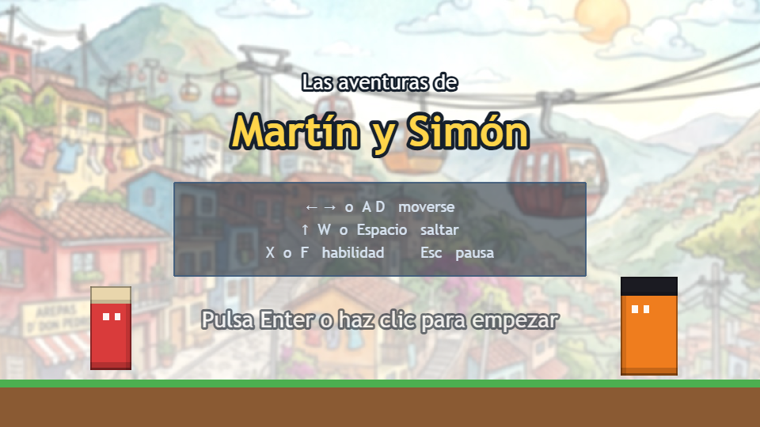
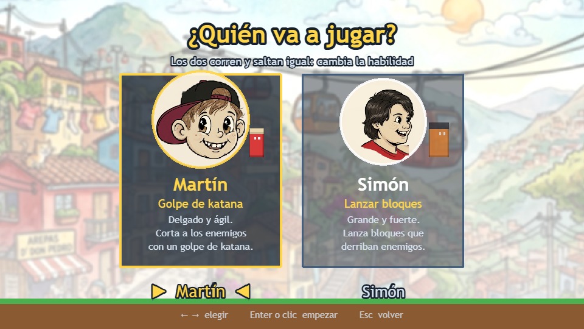
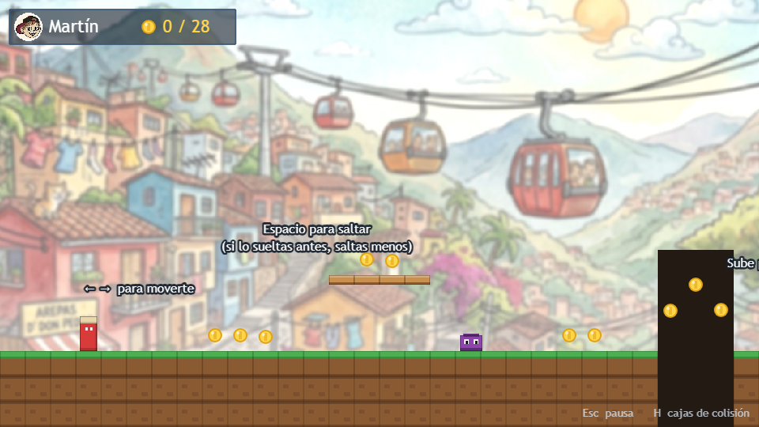

# Las aventuras de Martín y Simón

Juego de plataformas 2D hecho en casa para dos hermanos. Corre en el navegador,
sin instalar nada.

**▶ [Jugar](https://danielpenaospina1986.github.io/aventura-martin-simon/)**



## Los dos personajes

Corren y saltan exactamente igual. Lo único que cambia es la habilidad, y el
nivel se puede terminar con cualquiera de los dos.



- **Martín** — samurái. Su katana elimina a los enemigos que tenga delante.
- **Simón** — constructor. Lanza bloques de 32×32 que derriban a los enemigos.
  Puede tener tres volando a la vez.

Al final del nivel espera **el jefe**: aguanta tres golpes y, mientras siga en pie,
la meta está cerrada. Se le puede saltar encima o atacarle con la habilidad.

## Controles

| Acción | Teclas |
|---|---|
| Moverse | ← → o A D |
| Saltar | ↑, W o Espacio |
| Habilidad | X o F |
| Confirmar en los menús | Enter o clic |
| Pausa | Esc |
| Ver las cajas de colisión | H |

## Cómo está pensado

Es un juego generoso: **no hay vidas ni "game over"**. Si un enemigo te toca de
lado o te caes a un agujero, parpadeas y vuelves al último punto de control sin
perder monedas. Saltar encima de un enemigo lo elimina.



## Para tocarlo

```bash
npm install
npm run dev       # abrir el juego en el navegador
npm run validar   # comprobar que el nivel sigue siendo jugable
npm run probar    # pruebas automáticas en un navegador de verdad
npm run build     # compilar a dist/
```

En Windows también hay un **`JUGAR.bat`** que lo arranca con doble clic.

Los niveles son mapas de texto editables a mano en
[`src/niveles/`](src/niveles/): cada carácter es una casilla de 32×32 px.

```
...P....CCC.........E.CC.....
##########################...
```

`#` suelo · `=` plataforma que se atraviesa desde abajo · `C` moneda ·
`E` enemigo · `J` jefe · `K` punto de control · `M` meta · `P` inicio · `.` vacío

Después de editar un nivel, `npm run validar` calcula la parábola real del salto
a partir de [`src/config/ajustes.js`](src/config/ajustes.js) y comprueba que se
puede llegar a la meta sin usar habilidades.

Todos los detalles del proyecto están en [CLAUDE.md](CLAUDE.md).

## Hecho con

[Phaser 4](https://phaser.io) y [Vite](https://vite.dev). Los gráficos son
provisionales: se generan por código en `src/sistemas/dibujo.js` mientras llega
el pixel art.

Todo el arte es original. No se usan personajes, sprites, tipografías ni música
de ninguna marca ni franquicia.
